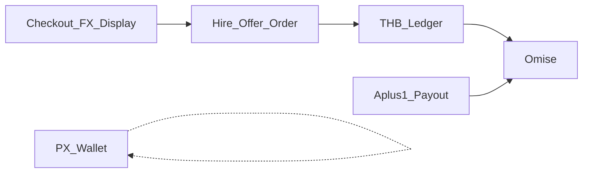

# Aplus1 Payments (Omise / Opn)

Canonical payment architecture for **Aplus1 (Anthem)**.  
Aplus1 owns money flows. Omise is the PSP only. **Do not** route Aplus1 payments through So1o/Solo Stripe APIs.

Related: [aml-compliance.md](./aml-compliance.md) (PX closed-loop) · hire cancel flow in `src/lib/hireCancelRequest.ts`

## Direction (locked)

| Topic | Rule |
|-------|------|
| PSP | Omise (Opn) only for Aplus1 fiat |
| Solo | Not a billing hub for Aplus1. Shared auth/email OK. |
| Stripe in Anthem | Deprecated — do not call Solo `/api/payments/*` |
| PX | In-app unit (gifts/rewards). **Not** FX. |
| Display currency | THB + USD (and admin rates) for offers / portfolio prices / checkout display |
| Settlement | THB satang in internal ledger + Omise charges |
| Live | Blocked until `OMISE_MARKETPLACE_APPROVED=true` |

## Environment

| Variable | Role |
|----------|------|
| `OMISE_PUBLIC_KEY` | Client tokenization only |
| `OMISE_SECRET_KEY` | Server only — never Vite |
| `OMISE_WEBHOOK_SECRET` | Webhook authenticity |
| `OMISE_MODE` | `test` \| `live` |
| `OMISE_MARKETPLACE_APPROVED` | `true` only after Omise marketplace/PayFac approval |
| `OMISE_MERCHANT_NAME` | Statement / merchant display |
| `PAYMENT_PROVIDER` | `omise` for Aplus1 |
| `VITE_APLUS1_PAYMENTS_ENABLED` | Product gate for payment UI |
| `VITE_APLUS1_DISPLAY_CURRENCY_ENABLED` | FX display switcher |

Feature flags (config / admin):  
`omisePaymentsEnabled`, `omisePromptPayEnabled`, `omiseCardEnabled`, `manualPayoutEnabled`, `autoPayoutEnabled`, `endOfMonthSweepEnabled`, `liveMarketplacePaymentsEnabled`, `cardFeePassedToBuyer`, `displayCurrencyEnabled`, `bankTransferEnabled`

When `OMISE_MARKETPLACE_APPROVED=false` or `liveMarketplacePaymentsEnabled=false`: no live charge/transfer.

## Fees

- Platform fee default **10%** of job price — **snapshot on order create** (`platformFeeRate`, `platformFeeAmount`, `feeVersion`)
- PromptPay: buyer pays job price; Aplus1 bears PSP cost (config override allowed)
- Card: optional buyer surcharge via Admin fee config; show before confirm
- Bank transfer: off until Omise confirms support
- All money math in **integer satang** — no float

## Internal ledger (THB)

Append-only `ledger_entries`. Balances: `pendingBalance`, `availableBalance`, `payoutReservedBalance`, `paidOutBalance`, `disputedBalance`.

Never mark seller **available** on payment webhook alone — only after client approve / auto-approve / admin dispute resolution.

Entry types include: `payment_received`, `payment_processing_fee`, `platform_fee`, `seller_pending_credit`, `seller_available_credit`, `payout_reserved`, `payout_completed`, `payout_failed`, `refund_debit`, `chargeback_debit`, `manual_adjustment`, `dispute_hold`, `dispute_release`.

## Hire money lifecycle

1. Offer accepted → create `hire_order` + Omise charge (PromptPay/Card)
2. Webhook paid → ledger pending (seller)
3. Work submitted → client approve or auto-approve
4. Pending → available
5. Seller withdraws per Aplus1 Payout policy (aggregated transfer)

Hire cancel (`hire_cancel_requests` money terms) must eventually drive real refund/compensation ledger + Omise refund — not agreement text only.

## Display currency (FX display)

- Not PX conversion
- User preference `display_currency` (THB | USD …)
- Admin `fx_rates` + snapshot on offer/order create
- Checkout shows **payable THB** + optional converted label

## Aplus1 Payout

- Manual: min **1,000 THB**, **1 free** withdrawal per calendar month (Asia/Bangkok), then **25 THB**/request
- Auto weekly: transfer if available ≥ 1,000; end-of-month sweep transfers remainder
- Aggregate many orders into one Omise transfer + `payout_items`
- Verified bank recipient + KYC required

## Code map

| Area | Path |
|------|------|
| Types / flags | `src/lib/payments/*` |
| FX display | `src/lib/payments/fxDisplay.ts` |
| Fees | `src/lib/payments/fees.ts` |
| Ledger helpers | `src/lib/payments/ledger.ts` |
| Omise provider | `src/lib/payments/omiseProvider.ts` |
| Payout policy | `src/lib/payments/payoutPolicy.ts` |
| SQL | `scripts/ecosystem/aplus1-omise-payments.sql` |
| Admin RPCs | `scripts/ecosystem/aplus1-admin-finance.sql` |
| Admin UI | `/admin/finance` · `src/hooks/admin/useAdminFinance.ts` |
| Hire cancel (status) | `src/lib/hireCancelRequest.ts` |

## Admin ops (`/admin/finance`)

หมวดตรวจสอบ Omise + THB ledger (แยกจาก `/admin/wallet` PX):

| แท็บ | ตรวจ | RPC หลัก |
|------|------|----------|
| ภาพรวม KPI | pending/available, คิวโอน, webhook, dispute, fee 30d | `admin_finance_overview` |
| ออเดอร์ / ชำระ | hire_orders + payments + detail drawer | `admin_list_hire_orders`, `admin_list_payments` |
| ยอด / Ledger | balances + append-only entries + manual adjust (audit) | `admin_list_account_balances`, `admin_finance_ledger`, `admin_manual_ledger_adjustment` |
| ถอน / ผู้รับ | payout queue, verify recipient, retry failed | `admin_list_payout_requests`, `admin_list_recipients`, … |
| คืนเงิน / ข้อพิพาท | refunds + resolve dispute | `admin_list_refunds`, `admin_list_disputes`, `admin_resolve_dispute` |
| Webhook | unprocessed / errors → reprocess (ไม่ auto-fix ยอด) | `admin_list_provider_events`, `admin_mark_provider_event_reprocess` |
| ตั้งค่า | fee, FX USD, payment flags | `admin_update_fee_config`, `admin_upsert_fx_rate`, `admin_update_payment_flags` |

Apply order: `aplus1-omise-payments.sql` → `aplus1-admin-finance.sql`.

## Ask Omise before production

Marketplace/PayFac, holding funds for third parties, recipients + KYC, delayed payout, platform fee, refund/chargeback, multi-recipient, statement name, individual vs company account, PromptPay cost bearer, card surcharge legality.

## Cutover from Solo Stripe

1. Anthem stops calling Solo payment APIs (Phase 1) — `stripePaymentsApi.ts` refuses Solo hub calls
2. New fiat flows use Omise + Aplus1 ledger (`src/lib/payments/*`, `scripts/ecosystem/aplus1-omise-payments.sql`)
3. Webhooks: `Anthem-Code/api/omise-webhook.js` · cron stub: `api/aplus1-payout-cron.js`
4. Legacy Stripe/escrow rows: ops complete manually — no new Aplus1 volume on Solo hub
5. Solo keeps its own Stripe for Solo product only (`Solo-Code/docs/stripe.md`)
6. Admin: `/admin/finance` · Earnings THB buckets on `/earnings`

## Security

- Never expose Omise secret to client
- Verify webhooks; never trust client amounts
- Idempotency keys + unique provider event IDs
- Encrypt bank account numbers; show masked only
- See also Solo payment skill for Solo-only surfaces — Aplus1 follows this doc
