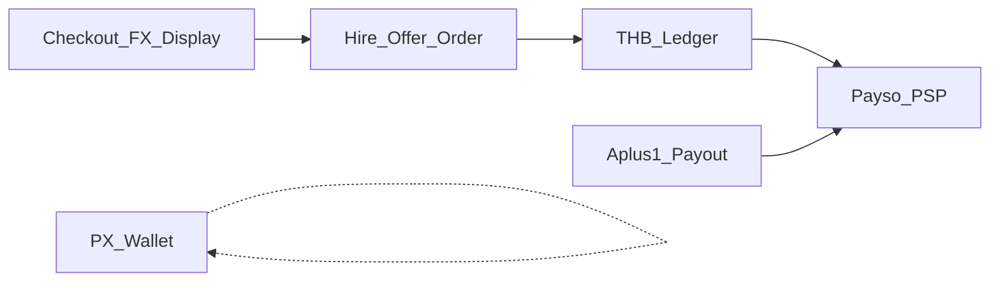

# Aplus1 Payments (Payso commercial · Omise/Opn code paths)

Canonical payment architecture for **Aplus1 (Anthem)**.  
Aplus1 owns money flows. **Do not** route Aplus1 payments through So1o/Solo Stripe APIs.

**Commercial PSP (merchant):** [Payso](https://payso.co/th) — บริษัท เพย์ โซลูชั่น จำกัด · Quotation `Q-202607000297` (27/07/2026 → valid until 31/10/2026)  
**Code / env (historical names):** many modules still use `Omise` / `OMISE_*` identifiers — treat as the fiat provider integration layer until renamed; commercial rates & SLAs below follow **Payso**.

Related: [aml-compliance.md](./aml-compliance.md) (PX closed-loop) · hire cancel flow in `src/lib/hireCancelRequest.ts` · user policy `/legal/payment-refund`

## Direction (locked)

| Topic | Rule |
|-------|------|
| PSP (commercial) | **Payso** for Aplus1 fiat merchant terms |
| PSP (code) | Existing `omise*` / `OMISE_*` paths until cutover rename |
| Solo | Not a billing hub for Aplus1. Shared auth/email OK. |
| Stripe in Anthem | Deprecated — do not call Solo `/api/payments/*` |
| PX | In-app unit (gifts/rewards). **Not** FX. |
| Display currency | THB + USD (and admin rates) for offers / portfolio prices / checkout display |
| Settlement | THB satang in internal ledger + PSP charges; Payso settles to merchant **weekly (T+7)** |
| Role | Aplus1 is a **payment intermediary / collection agent** — hire money is held for the seller; Aplus1 revenue is **platform fee only** |
| Docs | Quotation → Invoice → Receipt (seller↔buyer) + platform fee receipt (Aplus1→seller); optional WHT 50 ทวิ |
| Live | Blocked until marketplace/live flags approved (`OMISE_MARKETPLACE_APPROVED` / successor) |

```mermaid
flowchart LR
  Hire[Hire_Offer_Order] --> Ledger[THB_Ledger]
  UI[Checkout_FX_Display] --> Hire
  Ledger --> PSP[Payso_PSP]
  Payout[Aplus1_Payout] --> PSP
  PX[PX_Wallet] -.-> PX
```

## Environment

| Variable | Role |
|----------|------|
| `OMISE_PUBLIC_KEY` | Client tokenization only (legacy name) |
| `OMISE_SECRET_KEY` | Server only — never Vite |
| `OMISE_WEBHOOK_SECRET` | Base64 webhook HMAC secret (dashboard Roll secret) |
| `OMISE_MODE` | `test` \| `live` |
| `OMISE_MARKETPLACE_APPROVED` | `true` only after marketplace/PayFac approval |
| `OMISE_MERCHANT_NAME` | Statement / merchant display |
| `PAYMENT_PROVIDER` | `omise` for Aplus1 (rename when Payso SDK lands) |
| `VITE_OMISE_CHARGES_ENABLED` | `true` → checkout calls `/api/hire-charge` (test OK without marketplace) |
| `VITE_OMISE_MODE` | Client mirror of test/live gate |
| `VITE_OMISE_PUBLIC_KEY` | Public key for future card tokenization |
| `VITE_APLUS1_PAYMENTS_ENABLED` | Product gate for payment UI |
| `VITE_LEGAL_VAT_REGISTERED` | `true` when Aplus1 issues VAT tax invoices on fee receipts |
| `VITE_LEGAL_COMPANY_TAX_ID` | Company tax ID on fee receipts / ETDA disclosure |
| `VITE_HIRE_POLICY_VERSION` / `VITE_PAYMENT_POLICY_VERSION` | Consent versions stored on quote accept |
| `VITE_APLUS1_DISPLAY_CURRENCY_ENABLED` | FX display switcher |

Feature flags (config / admin):  
`omisePaymentsEnabled`, `omisePromptPayEnabled`, `omiseCardEnabled`, `manualPayoutEnabled`, `autoPayoutEnabled`, `endOfMonthSweepEnabled`, `liveMarketplacePaymentsEnabled`, `cardFeePassedToBuyer`, `displayCurrencyEnabled`, `bankTransferEnabled`

When `OMISE_MARKETPLACE_APPROVED=false` or `liveMarketplacePaymentsEnabled=false`: no live charge/transfer.

## Fees

### Platform (Aplus1 ↔ users)

- Platform fee default **10%** of job price — **snapshot on order create** (`platformFeeRate`, `platformFeeAmount`, `feeVersion`)
- Card: optional buyer surcharge via Admin fee config; **show before confirm**
- All money math in **integer satang** — no float

### Payso commercial (Aplus1 ↔ PSP) — from Q-202607000297

Rates **exclude VAT 7%**. Set-up / annual service fee: **waived**.

| Channel | Rate / notes |
|---------|----------------|
| PromptPay QR | **1.35%/TXN** · min fee **5 THB**/txn · amount **6–699,999 THB**/txn · if %-fee > 5 THB charge % |
| Card VISA/MC (TH + intl) | **3%/TXN** |
| Card JCB/CUP (TH + intl) | **3%/TXN** |
| Card AMEX (THB only) | **4%/TXN** · subject to provider approval |
| Internet / Mobile Banking | **3%/TXN** · min pay 15 THB · if amount < 1,000 THB fixed **15 THB**/txn |
| E-wallet (Alipay, TrueMoney) | **3%/TXN** |
| Shopee Pay family | **3%/TXN** · subject to provider approval |
| Installment 3–10 mo | Buyer bears monthly interest (bank-specific) + **3%/TXN** |

**Cost bearer (product default):**

- PromptPay: Aplus1 bears PSP cost (config override allowed) — ensure platform fee 10% covers 1.35% + VAT + ops
- Card: prefer `cardFeePassedToBuyer=true` when live; show surcharge (~3–4%) before confirm

### Settlement & transfer (Payso → Aplus1 merchant account)

| Item | Value |
|------|--------|
| Settlement cycle | **Weekly (T+7)** |
| “T” window | 21:00 previous day → 20:59 current day |
| Transfer fee | Kasikorn **6 THB**/batch · other banks **15 THB**/batch |
| Auto transfer min | **100 THB**/batch |
| Max per batch | **2,000,000 THB** (auto-split above) |

Creator payout UX must not promise same-day bank credit ignoring T+7 merchant settlement.

### Refund / void (Payso card rules — ops)

| Case | Rule |
|------|------|
| Void (same day) | 00:01–19:30 on txn day · full refund to buyer · no extra fee · ~24h |
| Refund (next day+) | After 19:30 or next day · merchant fee / installment interest may be deducted · buyer credit **~14–30 business days** |
| Late cancel (>7 days) | Extra **300 THB**/txn (all cases) |
| Status | Void/Refund only for **Completed** txns · email confirm to merchant |

User-facing copy: `/legal/payment-refund` (7–14 days typical; card up to 14–30).

### Processing limits (Payso default — ops)

| Merchant type | Monthly | Per txn |
|---------------|---------|---------|
| Juristic + full latest financials | Full monthly | ≤ 500,000 THB |
| Juristic new / incomplete financials | ≤ 500,000 THB | ≤ 50,000 THB |
| Individual | ≤ 50,000 THB | ≤ 20,000 THB |

Payso may change limits; raise via Line OA `@payso` / 02-089-2869 (option 4).

### Policy locks for outcome math

1. Cancelled jobs do **not** take platform fee 10% (unless an explicit exception is documented).
2. Unrefundable Payso fees / late cancel **300 THB** after 7 days — default bearer: **platform**.
3. `half_refund` is of **amount paid**, not full job price.
4. Deposit-only cancel does **not** auto-charge the unpaid balance.

**Outcome engine (source of truth):** `src/lib/payments/hireMoneyOutcome.ts`  
- Admin: `/admin/finance` order drawer → `HireMoneyOutcomePanel`  
- Legal demos + FAQ: `/legal/payment-refund#scenarios`  
- Unit tests: `src/lib/payments/__tests__/hireMoneyOutcome.test.ts`

## Internal ledger (THB)

Append-only `ledger_entries`. Balances: `pendingBalance`, `availableBalance`, `payoutReservedBalance`, `paidOutBalance`, `disputedBalance`.

Never mark seller **available** on payment webhook alone — only after client approve / auto-approve / admin dispute resolution.

Entry types include: `payment_received`, `payment_processing_fee`, `platform_fee`, `seller_pending_credit`, `seller_available_credit`, `payout_reserved`, `payout_completed`, `payout_failed`, `refund_debit`, `chargeback_debit`, `manual_adjustment`, `dispute_hold`, `dispute_release`.

## Hire money lifecycle

1. Seller sends quote (`hire_quotes`, 48h expiry) → buyer accepts policies → checkout
2. PSP charge (full or deposit %) → webhook paid → `hiring_requests=ตอบรับ`, ledger pending
3. Seller submits work (`hire_deliveries`) → `awaiting_approval` (+7d dispute window if client silent)
4. Client approve only (no auto-approve) → pending → available + platform fee receipt
5. Optional WHT 50 ทวิ flow (does not block payout)
6. Seller withdraws per Aplus1 Payout policy (after funds are available post-settlement)

SQL: `scripts/ecosystem/aplus1-hire-flow-docs.sql` (+ `aplus1-omise-payments.sql`). Dashboard: `/dashboard`.

Hire cancel (`hire_cancel_requests` money terms) must eventually drive real refund/compensation ledger + PSP refund — not agreement text only.

## Display currency (FX display)

- Not PX conversion
- User preference `display_currency` (THB | USD …)
- Admin `fx_rates` + snapshot on offer/order create
- Checkout shows **payable THB** + optional converted label

## Aplus1 Payout

- Manual: min **1,000 THB**, **1 free** withdrawal per calendar month (Asia/Bangkok), then **25 THB**/request
- Auto weekly: transfer if available ≥ 1,000; end-of-month sweep transfers remainder
- Aggregate many orders into one PSP transfer + `payout_items`
- Verified bank recipient + KYC required
- Align weekly auto payout with Payso **T+7** merchant settlement so reserved funds exist before transfer

## Code map

| Area | Path |
|------|------|
| Types / flags | `src/lib/payments/*` |
| FX display | `src/lib/payments/fxDisplay.ts` |
| Fees | `src/lib/payments/fees.ts` |
| Ledger helpers | `src/lib/payments/ledger.ts` |
| Provider (legacy Omise name) | `src/lib/payments/omiseProvider.ts` |
| Payout policy | `src/lib/payments/payoutPolicy.ts` |
| SQL | `scripts/ecosystem/aplus1-omise-payments.sql` |
| Admin RPCs | `scripts/ecosystem/aplus1-admin-finance.sql` |
| Admin UI | `/admin/finance` · `src/hooks/admin/useAdminFinance.ts` |
| Hire cancel (status) | `src/lib/hireCancelRequest.ts` |
| User legal | `src/pages/legal/PaymentRefundPage.tsx` |

## Admin ops (`/admin/finance`)

หมวดตรวจสอบ PSP + THB ledger (แยกจาก `/admin/wallet` PX):

| แท็บ | ตรวจ | RPC หลัก |
|------|------|----------|
| ภาพรวม KPI | pending/available, คิวโอน, webhook, dispute, fee 30d | `admin_finance_overview` |
| ออเดอร์ / ชำระ | hire_orders + payments + detail drawer | `admin_list_hire_orders`, `admin_list_payments` |
| ยอด / Ledger | balances + append-only entries + manual adjust (audit) | `admin_list_account_balances`, `admin_finance_ledger`, `admin_manual_ledger_adjustment` |
| ถอน / ผู้รับ | payout queue, verify recipient, retry failed | `admin_list_payout_requests`, `admin_list_recipients`, … |
| คืนเงิน / ข้อพิพาท | refunds + resolve dispute | `admin_list_refunds`, `admin_list_disputes`, `admin_resolve_dispute` |
| Webhook | unprocessed / errors → reprocess (ไม่ auto-fix ยอด) | `admin_list_provider_events`, `admin_mark_provider_event_reprocess` |
| ตั้งค่า | fee, FX USD, payment flags | `admin_update_fee_config`, `admin_upsert_fx_rate`, `admin_update_payment_flags` |

Apply order: `aplus1-omise-payments.sql` → `aplus1-admin-finance.sql`.

## Ask PSP before production

Marketplace/PayFac, holding funds for third parties, recipients + KYC, delayed payout, platform fee, refund/chargeback, multi-recipient, statement name, individual vs company account, PromptPay cost bearer, card surcharge legality, Payso processing limits & T+7 settlement.

## Cutover from Solo Stripe

1. Anthem stops calling Solo payment APIs (Phase 1) — `stripePaymentsApi.ts` refuses Solo hub calls
2. New fiat flows use PSP + Aplus1 ledger (`src/lib/payments/*`, `scripts/ecosystem/aplus1-omise-payments.sql`)
3. Charge API: `Anthem-Code/api/hire-charge.js` · Webhooks: `api/omise-webhook.js` · cron stub: `api/aplus1-payout-cron.js`
4. Legacy Stripe/escrow rows: ops complete manually — no new Aplus1 volume on Solo hub
5. Solo keeps its own Stripe for Solo product only (`Solo-Code/docs/stripe.md`)
6. Admin: `/admin/finance` · Earnings THB buckets on `/earnings`

## Security

- Never expose PSP secret to client
- Verify webhooks; never trust client amounts
- Idempotency keys + unique provider event IDs
- Encrypt bank account numbers; show masked only
- See also Solo payment skill for Solo-only surfaces — Aplus1 follows this doc
