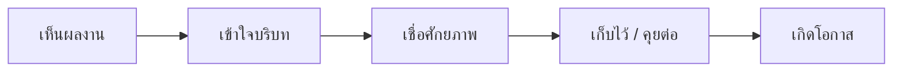
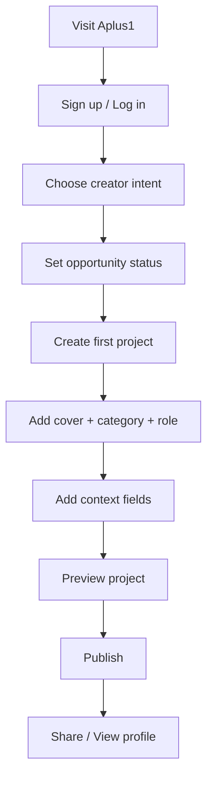
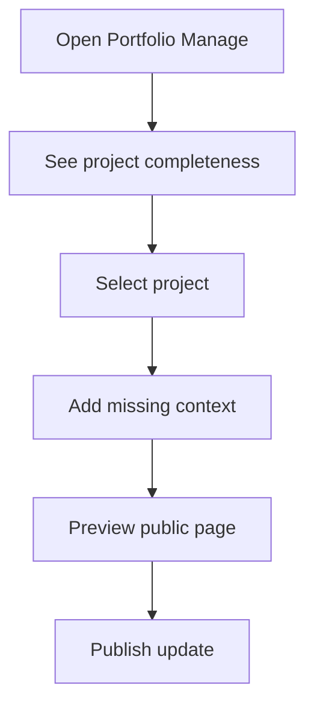
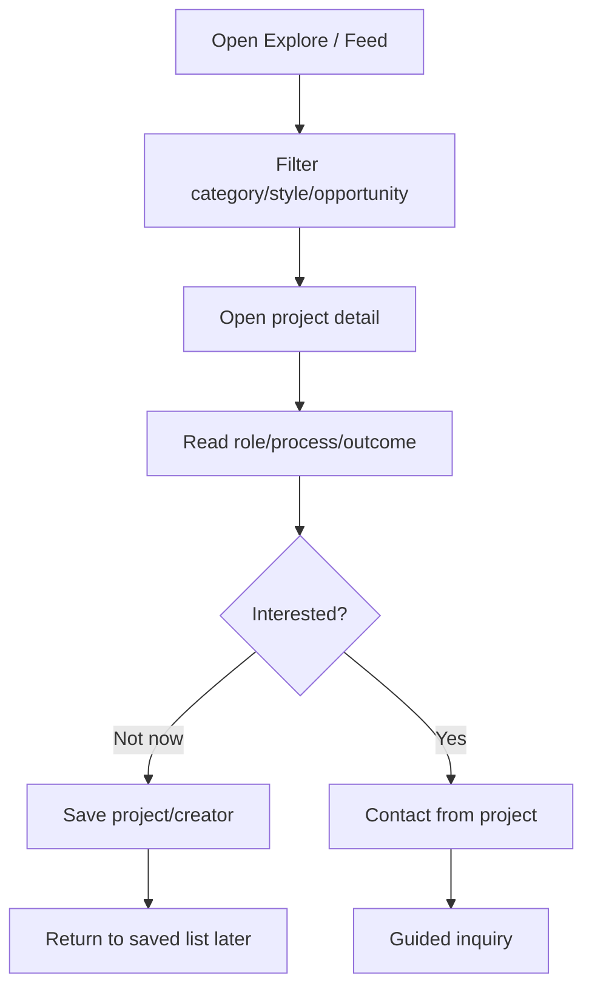
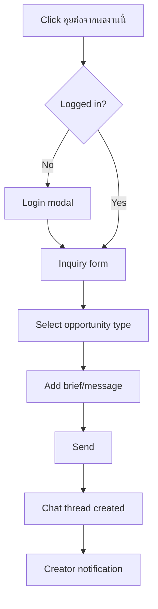
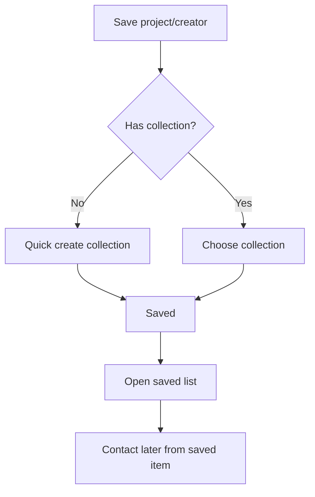
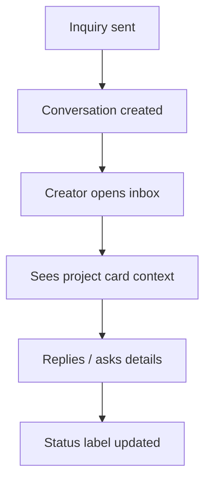

# Aplus1 UX Flow: ผลงานจริง -> โอกาส

Updated: 2026-07-03  
Audience: Founder, design, engineering, Cursor  
Scope: non-admin user experience for creator, hirer, and opportunity giver

## 1. UX North Star

The product should make users feel:

- Creator: "ผลงานของฉันมีที่ไป และฉันไม่ต้องขายตัวเองจากศูนย์ทุกครั้ง"
- Hirer: "ฉันเห็นของจริง เข้าใจบริบท และเริ่มคุยจากงานที่สนใจได้"

Core UX transition:

## 2. Information Architecture

Primary navigation should prioritize:

1. Explore / Feed
2. Projects
3. Opportunities / Jobs
4. Collections / Saved
5. Chat / Inbox
6. Portfolio / Manage
7. Settings

Recommended language:

- Use "โอกาส" for platform-level concept.
- Use "งาน" only for paid job/posting contexts.
- Prefer "คุยต่อจากผลงานนี้" over "Hire" in discovery.

## 3. Core Flow A: First-Time Creator Onboarding

### Goal

Creator publishes first meaningful project and sets opportunity status.

### Flow

### Screen Requirements

#### Onboarding Intent Screen

Purpose:

- Let user identify as creator, hirer, or both.
- Do not block users with long survey.

Fields:

- I want to: `ลงผลงาน`, `ค้นหาครีเอเตอร์`, `ทั้งสองอย่าง`
- Creative category optional
- Opportunity status optional but recommended

UX notes:

- Allow skip.
- If skipped, remind later on portfolio manage.
- Avoid overlay on task routes such as chat/project/jobs/settings.

Acceptance criteria:

- User can complete onboarding in under 60 seconds.
- User can skip and still reach main product.
- Cookie consent/auth overlays must not hide primary action.

#### Opportunity Status Step

Default label:

- เปิดรับโอกาส

Selectable types:

- รับงานจ้าง
- พร้อมร่วมโปรเจกต์
- มองหาฝึกงาน
- สนใจเข้าทีม
- เปิดรับ feedback / mentor
- ยังไม่รับงาน แต่คุยโอกาสได้

Acceptance criteria:

- User can choose multiple types.
- Status appears on public profile and relevant project pages.
- Status can be edited later from portfolio/settings.

#### First Project Upload

Required fields for publish:

- cover image
- title
- category
- role
- visibility

Recommended fields:

- โจทย์ของงานนี้
- บทบาทของฉัน
- วิธีคิด / process
- สิ่งที่ส่งมอบ
- เครื่องมือที่ใช้
- ระยะเวลา
- ผลลัพธ์ / สิ่งที่ได้เรียนรู้
- โอกาสที่เกี่ยวข้องกับงานนี้

Acceptance criteria:

- User can save draft at any time.
- Publish button is disabled with clear inline reason if required fields are missing.
- Upload failure shows retry action.
- Success screen confirms project is live and offers share/view profile.

## 4. Core Flow B: Returning Creator Adds Better Context

### Goal

Creator improves a project so it attracts better opportunities.

### Flow

### UX Requirements

- Show project completeness score softly, not as harsh grading.
- Suggest one next best improvement, not a long checklist.
- Encourage context, not just more images.

Example microcopy:

> เพิ่มบทบาทหรือวิธีคิดอีกนิด จะช่วยให้คนเข้าใจศักยภาพของงานนี้มากขึ้น

Acceptance criteria:

- Creator sees which fields improve trust.
- Draft changes are not lost on refresh/back where technically possible.
- Updated public page reflects changes immediately after save.

## 5. Core Flow C: Hirer Discovers From Work

### Goal

Hirer finds creators by browsing real projects.

### Flow

### Project Card Requirements

Show:

- cover image
- title
- creator name/avatar
- category
- short role/status
- save action
- clear "ดูผลงาน" action

Avoid:

- "จ้างเลย" as primary CTA on card
- too much metadata that makes card noisy
- hover-only actions that disappear on mobile/tablet

Acceptance criteria:

- Card is clickable and keyboard accessible.
- Save action gives immediate feedback.
- If user is not logged in, save/contact prompts login and returns to original context.

### Project Detail Requirements

Above the fold:

- project visuals
- title
- creator identity
- opportunity status
- primary CTA: คุยต่อจากผลงานนี้
- secondary CTA: เก็บไว้ / ดูโปรไฟล์

Main content:

- role
- brief/problem
- process
- tools
- deliverables
- outcome/learning
- related works

Acceptance criteria:

- User can understand what the creator actually did.
- Contact CTA is always reachable on desktop and mobile without covering content.
- Missing optional fields do not render awkward empty sections.

## 6. Core Flow D: Project-Specific Inquiry

### Goal

Turn interest in a project into a useful conversation.

### Flow

### Inquiry Form Fields

Required:

- opportunity type
- message/brief
- project reference

Optional:

- timeline
- budget range
- preferred contact method
- attachments

Opportunity type options:

- งานจ้าง
- ร่วมโปรเจกต์
- ฝึกงาน/เข้าทีม
- ขอ feedback/mentor
- เก็บไว้คุยอนาคต
- อื่น ๆ

UX notes:

- Pre-fill message context: "สนใจงาน [project title] เพราะ..."
- Do not force budget for non-paid/non-client opportunities.
- If paid work is selected, budget/timeline can become recommended.

Acceptance criteria:

- Inquiry always stores project id/reference.
- Creator receives notification with project context.
- Hirer lands in chat/inbox after send.
- Duplicate rapid sends are prevented.
- Error shows whether retry is safe.

## 7. Core Flow E: Save / Collection / Shortlist

### Goal

Support users who are interested but not ready to contact.

### Flow

### UX Requirements

- Collection creation should be fast and low-friction.
- If a collection was just created, project detail save dialog must see it immediately.
- Saved state must be consistent between card, detail, and saved page.

Acceptance criteria:

- Creating a collection updates available collection list without refresh.
- User can save/remove from project card and detail.
- Empty state says what to do next.
- No "ยังไม่มีคอลเลกชัน" after a collection was just created.

## 8. Core Flow F: Chat / Opportunity Inbox

### Goal

Keep project-qualified opportunities understandable after the first message.

### Flow

### Inbox Requirements

Conversation list should show:

- sender/receiver
- opportunity type
- linked project title
- last message
- unread count
- time

Conversation detail should show:

- compact project reference card
- original inquiry
- message thread
- attachment rules
- report/block option

Acceptance criteria:

- Message persists after refresh.
- User cannot read private conversations they do not belong to.
- Chat attachments use signed/private URLs when private.
- Loading and permission errors are clear.

## 9. Core Flow G: Jobs / Opportunity Posts

### Goal

Allow opportunity posts without turning Aplus1 into a generic job board.

### UX Direction

Use "ประกาศโอกาส" rather than only "ลงประกาศงาน" when the opportunity is broad.

Post types:

- paid project
- collaboration
- internship
- part-time/full-time
- open brief

Required fields:

- title
- opportunity type
- description
- category
- deadline if application-based
- contact/apply method

Validation:

- deadline must be future date
- budget min must be <= max when both exist
- paid work should include budget guidance or "ยังไม่ระบุ"
- submit must show success/error

Acceptance criteria:

- Form cannot silently fail.
- Dialog fits 1366x768 desktop without hiding submit.
- Mobile and tablet have sticky footer action or scroll-safe submit.

## 10. Responsive UX Rules

### Desktop First

Primary test viewports:

- 1440x900
- 1366x768

Desktop requirements:

- Primary CTA visible without crowding.
- Dialogs fit short desktop height.
- Feed cards scan quickly.
- Project detail has strong visual hierarchy.

### Tablet

Primary test viewports:

- 1024x768
- 834x1194

Tablet requirements:

- Touch targets at least 44px.
- Side panels should collapse sensibly.
- No hover-only controls.

### Mobile

Primary test viewports:

- 390x844
- 430x932

Mobile requirements:

- Bottom nav/FAB must not cover submit/chat/send actions.
- Sticky actions should not hide final form fields.
- Long dialogs should become full-screen sheets.

## 11. Empty, Error, And Edge States

### Empty States

Creator no projects:

> ผลงานชิ้นแรกอาจเป็นจุดเริ่มต้นของโอกาสแรก

Saved empty:

> เก็บผลงานหรือ creator ที่อยากกลับมาดูภายหลัง

Search no results:

> ลองเปลี่ยนหมวด สไตล์ หรือประเภทโอกาส

### Error States

Rules:

- Never show only spinner forever.
- Every failed submit needs a reason and retry path.
- Permission denied should explain whether login, ownership, or privacy caused it.
- Production/local config issues must not surface as raw localhost URLs to users.

## 12. UX QA Checklist

For each release, test:

- New user can sign up and publish first project.
- Existing creator can edit project and opportunity status.
- Hirer can search, save, and contact from project.
- Collection created in one place appears in save dialog elsewhere.
- Chat message sends, appears after refresh, and is isolated between users.
- Non-owner cannot edit another creator's project.
- Job/opportunity post submit gives success/error.
- Verify/advertise routes do not hang indefinitely.
- Desktop short-height dialogs remain usable.
- Mobile/tablet actions are not covered by nav/FAB.

