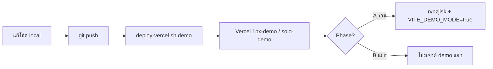
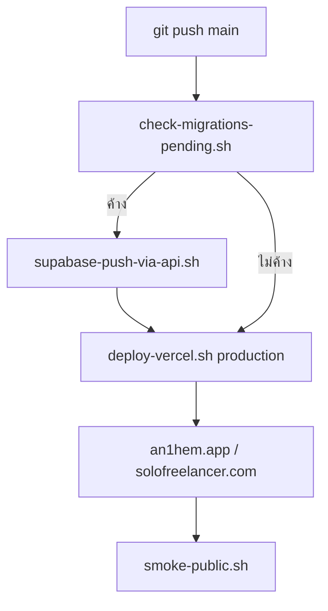

# Ecosystem Deploy & Database Policy

นโยบายรวมศูนย์: **เมื่อไหร่รวม DB / เมื่อไหร่แยก / อัปอะไรขึ้น production**  
อ่านคู่กับ [ecosystem-unified-account.md](ecosystem-unified-account.md) และ [.cursor/rules/deploy-workflow.mdc](../.cursor/rules/deploy-workflow.mdc)

---

## 1. สองมิติที่ต้องแยกให้ออก

| มิติ | คำตอบสำหรับ So1o + Pixel100 |
|------|------------------------------|
| **Production รวมกันหรือไม่** | **รวมเสมอ** — โปรเจกต์เดียว `zkflkpbmbozrchqncpzi` (So1o + an1hem + Ops Hub อ่าน schema เดียวกัน) |
| **Demo แยกจาก Production หรือไม่** | **ขึ้นกับช่วง** — ดู [§3 ช่วงชีวิต](#3-ช่วงชีวิตเมื่อไหร่รวมเมื่อไหร่แยก) |

สรุปสั้น: **บัญชีจริงรวมที่เดียว** ไม่ใช่ “แยก So1o กับ Pixel100” — คำถามจริงคือ **เดโม่/staging ชี้ DB ไหน**

---

## 2. สิ่งที่ไหลขึ้น Production (หลักการทำงานจริง)

```
โค้ด + SQL migration  →  staging/preview  →  production
```

| สิ่งที่อัป production | ทำไม |
|----------------------|------|
| Git commit (frontend/backend) | ฟีเจอร์และ UI |
| `supabase` migration (`Solo-Code/supabase/migrations`) | schema, RLS, RPC |
| Edge function / cron (ถ้ามี) | พฤติกรรม server |

| สิ่งที่ **ไม่** อัป production แบบ “ย้ายจากเดโม่” | ทำไม |
|--------------------------------------------------|------|
| แถวในตารางจาก demo DB | data สองที่ sync ไม่ได้, เสี่ยงทับ user จริง |
| Dump ทั้งก้อนจาก staging | ต้อง anonymize; ห้ามมี PII จริง |
| Seed script รันซ้ำบน prod โดยไม่เช็ค | ชน constraint / ทับลูกค้า |

**ข้อมูลจริงของลูกค้าไม่ไหลลง demo** — ถ้าต้องการความ realistic ใช้ `npm run db:qa-full` (synthetic seed) หรือ snapshot ที่ anonymize เป็นครั้งคราว

---

## 3. ช่วงชีวิต: เมื่อไหร่รวม / เมื่อไหร่แยก

### Phase A — Pre-launch (แนะนำ **ตอนนี้**)

**เงื่อนไข:** ยังไม่มีลูกค้าจ่ายเงินจริงจำนวนมาก · reviewer เป็นทีมภายใน · ยอมรับความเสี่ยง config ต่ำ

| รายการ | นโยบาย |
|--------|--------|
| Production DB | `zkflkpbmbozrchqncpzi` |
| Demo web (`1px-demo`, `solo-demo`) | **ชี้ `rvnzjisk` เดียวกัน** + `VITE_DEMO_MODE=true` |
| บัญชี demo | `@demo.pixel100.com` / `@demo.an1hem.app` — seed ด้วย `db:qa-full` |
| ข้อมูล user จริง | ยังไม่ copy ลง demo |

**ข้อดี:** ops ง่าย · migration ชุดเดียว · seed ครั้งเดียว · ตรงกับ `prepare-demo.sh`  
**ข้อเสีย:** ต้องระวังไม่ deploy demo build ชี้ prod โดยไม่ตั้งใจ (ใช้ build guard)

### Phase B — Post-launch / reviewer ภายนอก

**เงื่อนไข:** มีลูกค้าจริง · UX/security review ภายนอก · PDPA/KYC ต้องชัด

| รายการ | นโยบาย |
|--------|--------|
| Production DB | `zkflkpbmbozrchqncpzi` (ไม่เปลี่ยน) |
| Demo web | **โปรเจกต์ Supabase แยก** (`VITE_DEMO_SUPABASE_*`) |
| ข้อมูล | synthetic เท่านั้น · ห้าม copy prod |
| Load test | โปรเจกต์แยก (ดู `Anthem-Code/docs/production-readiness.md`) |

**ข้อดี:** reviewer ไม่แตะข้อมูลจริง · รหัส demo แชร์ได้ · ทดลอง migration ทำลายได้  
**ข้อเสีย:** ดูแล 2 โปรเจกต์ · bootstrap + seed ซ้ำ

### เกณฑ์ย้าย Phase A → B

ย้ายเมื่อ **อย่างน้อยหนึ่งข้อ** เป็นจริง:

- [ ] มี user จริงที่ไม่ใช่ทีม (> ~50 บัญชีที่มี PII)
- [ ] เปิดชำระเงิน / cashout จริง
- [ ] ส่งลิงก์ demo ให้ UX researcher ภายนอก
- [ ] ต้อง audit PDPA / เก็บ KYC จริง

---

## 4. แผนภาพ Deploy

### 4.1 Demo (แชร์ให้ลอง)



**คำสั่ง**

```bash
./scripts/deploy-vercel.sh demo 1px    # Pixel100
./scripts/deploy-vercel.sh demo solo   # So1o
```

**หลัง deploy สำเร็จ**

- ส่ง Preview URL + [demo-pack.md](demo-pack.md)
- Pixel100 login: `phatsawut@demo.pixel100.com` / `pixel100-demo-seed`
- Phase A: รัน `./scripts/prepare-demo.sh` ถ้าฟีดว่าง (seed บน `rvnzjisk`)

### 4.2 Production (พนักงาน / ลูกค้าจริง)



**คำสั่ง**

```bash
./scripts/check-migrations-pending.sh
# ถ้าค้าง → cd Solo-Code && ./scripts/supabase-push-via-api.sh
./scripts/deploy-vercel.sh production 1px
./scripts/deploy-vercel.sh production solo
```

**ข้อห้าม production**

- `VITE_DEMO_MODE=false` เสมอ
- ห้าม deploy production ถ้า migration ค้าง (ยกเว้นยืนยันรับความเสี่ยง)
- ห้ามใช้ `deploy-demo-vercel.sh` กับ production slot

---

## 5. ตาราง Env ตามสภาพแวดล้อม

### Production (`an1hem.app`, `solofreelancer.com`)

```env
VITE_DEMO_MODE=false
VITE_SUPABASE_URL=https://zkflkpbmbozrchqncpzi.supabase.co
VITE_SUPABASE_PUBLISHABLE_KEY=<prod anon>
# ไม่ตั้ง VITE_DEMO_SUPABASE_*
```

### Demo Phase A (รวม `rvnzjisk`)

```env
VITE_DEMO_MODE=true
VITE_SUPABASE_URL=https://zkflkpbmbozrchqncpzi.supabase.co
VITE_SUPABASE_PUBLISHABLE_KEY=<prod anon>
# ไม่ต้องมี VITE_DEMO_SUPABASE_* แยก
# deploy script ต้องอนุญาตโหมดนี้ (ดู Anthem-Code/docs/demo-isolation.md)
```

### Demo Phase B (แยกโปรเจกต์)

```env
VITE_DEMO_MODE=true
VITE_SUPABASE_URL=https://zkflkpbmbozrchqncpzi.supabase.co   # สำหรับ local dev ชี้ prod
VITE_DEMO_SUPABASE_URL=https://<demo-ref>.supabase.co       # build demo เท่านั้น
VITE_DEMO_SUPABASE_PUBLISHABLE_KEY=<demo anon>
# URL สองชุดต้องไม่เหมือนกัน — build guard ปฏิเสธถ้าซ้ำ
```

---

## 6. ข้อมูลและ PDPA

| กิจกรรม | อนุญาต | หมายเหตุ |
|---------|--------|----------|
| Seed 50 creators (`db:qa-full`) | ✅ | ข้อมูลสังเคราะห์ |
| Reviewer login บัญชี `@demo.*` | ✅ | ส่งรหัสทางช่องส่วนตัว |
| Copy prod → demo เพื่อพัฒนา | ❌ | ใช้ seed / anonymized subset |
| อัป prod จาก “state ใน demo” | ❌ | อัปแค่โค้ด + migration |
| เก็บรหัส demo ใน `VITE_*` | ❌ | ฝังใน bundle สาธารณะ |

---

## 7. Checklist ก่อนส่ง Demo ให้คนอื่น

**Phase A**

- [ ] `VITE_DEMO_MODE=true` บน build demo
- [ ] `./scripts/prepare-demo.sh` หรือ `db:qa-full` สำเร็จ
- [ ] Login demo ทดสอบบน URL ที่แชร์
- [ ] DevTools → Network ชี้ `rvnzjisk` (ทีมยอมรับแล้ว)

**Phase B** (เพิ่มจากด้านบน)

- [ ] Network ชี้ hostname demo แยก ไม่ใช่ `rvnzjisk`
- [ ] ไม่มีบัญชีลูกค้าจริงในโปรเจกต์ demo
- [ ] ปิด/จำกัด signup · ปิด cashout/LINE จริง
- [ ] หลัง review: rotate รหัส demo · re-seed

---

## 8. เอกสารที่เกี่ยวข้อง

| เอกสาร | เรื่อง |
|--------|--------|
| [ecosystem-unified-account.md](ecosystem-unified-account.md) | บัญชีรวม So1o + an1hem |
| [demo-pack.md](demo-pack.md) | ลิงก์ + login ส่ง reviewer |
| [Anthem-Code/docs/demo-isolation.md](../Anthem-Code/docs/demo-isolation.md) | Phase B รายละเอียด |
| [Anthem-Code/docs/production-readiness.md](../Anthem-Code/docs/production-readiness.md) | Gate ก่อน launch |
| [scripts/prepare-demo.sh](../scripts/prepare-demo.sh) | เตรียม demo ครั้งเดียว (Phase A) |

---

## 9. สถานะปัจจุบันใน repo (มิ.ย. 2026)

| รายการ | ค่า |
|--------|-----|
| Production Supabase | `zkflkpbmbozrchqncpzi` |
| ช่วงที่แนะนำ | **Phase A** (รวม demo กับ prod DB + seed) |
| โค้ด deploy demo | ยังบังคับ `VITE_DEMO_SUPABASE_*` แยก (เขียนสำหรับ Phase B) |
| งานถัดไป (ถ้าใช้ Phase A) | ผ่อน `deploy-demo-vercel.sh` ให้รองรับโหมดรวม — ดู issue / Agent |

เมื่อถึงเกณฑ์ §3 ให้สลับ Phase B และ bootstrap โปรเจกต์ demo แยกตาม [demo-isolation.md](../Anthem-Code/docs/demo-isolation.md)
