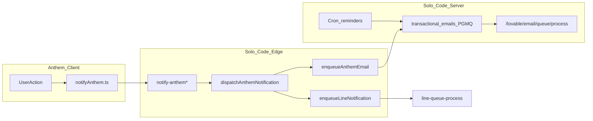

# Ecosystem Notifications — Email, LINE, In-App

เอกสารข้ามแอปสำหรับ So1o + an1hem (1PX) — อัปเดตตามโค้ดปัจจุบัน

## ภาพรวม



| ช่องทาง | ใครเป็นเจ้าของ | ส่งผ่าน |
|---------|---------------|---------|
| **So1o transactional** | So1o | TanStack server routes `/lovable/email/*` + PGMQ |
| **Anthem notification email** | Anthem templates → vendored ใน So1o | Edge `notify-anthem*` + `anthem-email-html.ts` |
| **LINE push** | Shared | Edge `line-queue-process` → Messaging API |
| **In-app** | Shared DB | `shared.notifications` / `ecosystem_notifications` |

---

## So1o transactional email

### Templates

- `Solo-Code/src/lib/email-templates/` + `registry.ts`
- ใช้กับ: project alerts, payment reminders, quotation, subscription, deadline reminders

### Server routes

| Route | ไฟล์ | หน้าที่ |
|-------|------|---------|
| `/lovable/email/auth/webhook` | `src/routes/lovable/email/auth/webhook.ts` | Supabase Auth hook → signup/recovery/magic-link |
| `/lovable/email/transactional/send` | `.../transactional/send.ts` | Client enqueue (ผ่าน `src/lib/email/send.ts`) |
| `/lovable/email/queue/process` | `.../queue/process.ts` | Worker อ่าน PGMQ → ส่งจริง |
| `/lovable/email/suppression` | `.../suppression.ts` | Suppression list |
| `/email/unsubscribe` | `src/routes/email/unsubscribe.ts` | Unsubscribe tokens |

### Cron flows

```
/api/public/cron/deadline-reminders
/api/public/cron/payment-reminders
  → deadlineReminders.server.ts / paymentReminders.server.ts
  → enqueueTemplateEmail → RPC enqueue_email
  → pg_cron → POST /lovable/email/queue/process
  → @lovable.dev/email-js (LOVABLE_API_KEY)
```

Sender: `notify.solofreelancer.com` / `solofreelancer.com`

---

## Anthem notification email

### Templates (React Email)

Canonical source: `Anthem-Code/src/lib/email-templates/`

| Template key | เหตุการณ์ |
|--------------|-----------|
| `hire-request` | คำขอจ้างงาน |
| `chat-message` | ข้อความแชทใหม่ |
| `job-match` | งานตรงโปรไฟล์ |
| `collab-request` | คำขอ collab |
| `gift-received` | ได้รับของขวัญ PX |
| `follow` | มีคนติดตาม |
| `job-application` | สมัครงาน |
| `topup-success` | เติม PX สำเร็จ |
| `cashout-status` | สถานะถอนเงิน |

Auth templates (6): `signup`, `invite`, `magic-link`, `recovery`, `email-change`, `reauthentication`

### Sync contract

- Build So1o รัน `scripts/vendor-anthem-email-templates.mjs` → `Solo-Code/src/lib/email/anthem-vendor/`
- Edge HTML mirror: `Solo-Code/supabase/functions/_shared/anthem-email-html.ts` — **ต้อง sync กับ Anthem templates**

### Preview (Anthem)

```bash
cd Anthem-Code
npm run email:icons    # generate icons
npm run email:preview  # → email-previews/
```

Brand/email domain: `1px.app` / `notify.1px.app` (ไม่ใช่ app URL หลัก)

---

## Event matrix — Anthem → Edge → Email → LINE

| เหตุการณ์ | Anthem caller | Edge function | Email template | LINE kind |
|-----------|---------------|---------------|----------------|-----------|
| Gift | `useGifting.ts` → `notifyAnthem({ event: "gift" })` | `notify-anthem` | `gift-received` | `anthem_gift` |
| Follow | `useFollow.ts` | `notify-anthem` | `follow` | `anthem_follow` |
| Job application | `useJobs.ts` | `notify-anthem` | `job-application` | `anthem_job_application` |
| Top-up | `EarningsPage.tsx` | `notify-anthem` | `topup-success` | `anthem_topup` |
| Cashout | `useCashout.ts`, admin | `notify-anthem` | `cashout-status` | `anthem_cashout` |
| Hire request | `HireDialog.tsx` | `notify-hire-request` | `hire-request` | `anthem_hire` |
| Chat message | `useChat.ts` | `notify-anthem-chat` | `chat-message` | `anthem_chat` |
| Collab request | `CollabDialog.tsx` | `notify-anthem-collab` | `collab-request` | `anthem_collab` |
| Job match | DB trigger | `job-match-dispatch` | `job-match` | `anthem_job_match` |

### Boost & Escrow (Stripe webhook → payment_notifications)

| เหตุการณ์ | Trigger | In-app (`payment_notifications`) | Email |
|-----------|---------|----------------------------------|-------|
| Boost สำเร็จ | Stripe webhook `kind=boost` | `boost.purchased` | — |
| Ads ชำระแล้ว | Stripe webhook `kind=ad` | `ad.paid` | — |
| Escrow ลูกค้าชำระ | Stripe webhook `kind=escrow` | `escrow.funded` | `deposit-received` (freelancer) |
| Escrow ปล่อยเงิน | Admin `/api/payments/escrow/release` | `escrow.released` | — |
| Escrow ลูกค้าอนุมัติ | RPC `client_approve_escrow` | — (admin release ตาม) | — |
| Escrow ข้อพิพาท | RPC `client_dispute_escrow` | — (admin panel) | — |

LINE kinds ที่แนะนำเพิ่มใน `lineNotificationKinds.ts`: `portal_escrow_funded`, `portal_escrow_released` (MVP ใช้ in-app + email ก่อน)

Client portal: `https://solofreelancer.com/pay/:portal_token` (anon RPC token-gated)

Client helper: `Anthem-Code/src/lib/notifyAnthem.ts` (fire-and-forget)

Shared dispatch: `Solo-Code/supabase/functions/_shared/anthem-notify-dispatch.ts`

---

## LINE notifications

### Connect flow

- หน้า `/line-link` (So1o + Anthem)
- OAuth: ช่อง **LINE Login** แยกจาก Messaging API
- Edge: `line-connect` (ไม่ใช่ `line-link-account` ที่ deprecated)
- Webhook: `line-webhook` (OA chat + AI assistant)
- Queue worker: `line-queue-process`

ดูรายละเอียด setup: [setup-line.md](./setup-line.md)

### Notification kinds

Canonical: `Solo-Code/src/lib/lineNotificationKinds.ts` (vendored ใน Anthem เป็น `lineNotificationKinds.vendored.ts`)

| กลุ่ม | kinds |
|-------|-------|
| Portal (So1o) | `portal_slip`, `portal_tracker_comment`, `portal_brief`, `portal_planner`, `portal_quotation` |
| Anthem | `anthem_hire`, `anthem_chat`, `anthem_job_match`, `anthem_collab`, `anthem_gift`, `anthem_follow`, `anthem_job_application`, `anthem_topup`, `anthem_cashout` |
| In-House | `inhouse_invite`, `inhouse_member_join`, `inhouse_chat`, `inhouse_task` |
| อื่น | `support_ticket`, `billing` |

Prefs เก็บใน `profiles.line_notify_prefs` (JSON). UI: Settings → LINE section (ต้อง Pro/Pro+)

---

## In-app notifications

| แอป | ไฟล์หลัก | ตาราง |
|-----|---------|-------|
| Anthem | `src/core/notifications/`, `NotificationsPage.tsx` | `shared.notifications` / `ecosystem_notifications` |
| So1o | notification hooks ใน features | `so1o.notifications` (legacy) + ecosystem |

Job match แยก: `job_match_notifications`

---

## User preferences

| คอลัมน์ | ใช้กับ |
|--------|--------|
| `profiles.notify_email` | เปิด/ปิด email ทั่วไป |
| `profiles.notify_hire` | แจ้งเตือนจ้างงาน |
| `profiles.notify_job_match` | แจ้งเตือนงานตรงโปรไฟล์ |
| `profiles.line_messaging_user_id` | LINE user ID หลังเชื่อม |
| `profiles.line_notify_prefs` | เปิด/ปิดแต่ละ LINE kind |

Dedupe: `email_send_log` RPC

---

## Environment variables

| Variable | ใช้ที่ | หมายเหตุ |
|----------|--------|----------|
| `LOVABLE_API_KEY` | So1o server | ส่ง email จริง |
| `ANTHEM_APP_URL` | Edge | default `https://an1hem.app` (prod) |
| `ANTHEM_EMAIL_FROM` | Edge | เช่น `1PX <noreply@1px.app>` |
| `ANTHEM_EMAIL_SENDER_DOMAIN` | Edge | `notify.1px.app` |
| `VITE_LINE_CHANNEL_ID` | Client | จากช่อง LINE Login |
| `LINE_CHANNEL_SECRET` | Edge `line-connect` | จากช่อง LINE Login |
| `LINE_CHANNEL_ACCESS_TOKEN` | Edge | จาก Messaging API |
| `LINE_MESSAGING_CHANNEL_SECRET` | Edge `line-webhook` | จาก Messaging API |
| `JOB_MATCH_DISPATCH_SECRET` | Edge `job-match-dispatch` | internal secret header |

---

## Deploy edge functions (notify + LINE)

```bash
cd Solo-Code
export SUPABASE_ACCESS_TOKEN=sbp_...

supabase functions deploy \
  notify-anthem notify-anthem-chat notify-anthem-collab notify-hire-request \
  job-match-dispatch \
  line-connect line-webhook line-queue-process \
  --project-ref rvnzjiskqliexysicfmh
```

Gemini/AI functions deploy แยก — ดู `Solo-Code/supabase/README.md`

---

## QA checklist (manual)

1. **Email preview:** `cd Anthem-Code && npm run email:preview` — เปิด `email-previews/index.html`
2. **Hire flow:** ส่งคำขอจ้าง → ตรวจ email + LINE + in-app ที่ผู้รับ
3. **Gift:** ส่งของขวัญ → ตรวจ `gift-received` template
4. **Settings opt-out:** ปิด `notify_hire` → ส่ง hire อีกครั้ง → ไม่ควรได้ email
5. **LINE connect:** `/line-link` → เชื่อมบัญชี → ส่ง test samples จาก Settings
6. **So1o cron:** ตั้ง reminder ใกล้ครบ → ตรวจ transactional queue
7. **Job match:** trigger จาก DB → ตรวจ `job-match-dispatch` (ต้องมี secret)

ดูรายการเต็ม: [MANUAL-TESTING.md](./MANUAL-TESTING.md)

---

## เอกสารที่เกี่ยวข้อง

- [setup-line.md](./setup-line.md) — LINE Console + secrets
- [Solo-Code/docs/stripe.md](../Solo-Code/docs/stripe.md) — PX top-up lookup keys
- [Anthem-Code/docs/aml-compliance.md](../Anthem-Code/docs/aml-compliance.md) — cashout/topup flows
- [Solo-Code/supabase/README.md](../Solo-Code/supabase/README.md) — edge function JWT table
